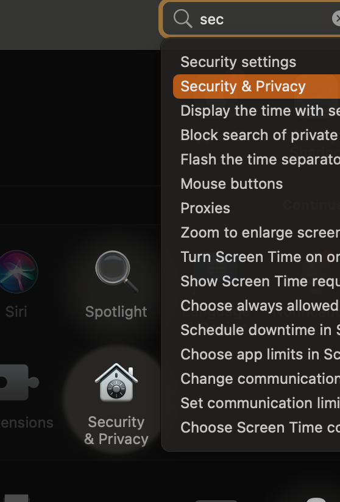
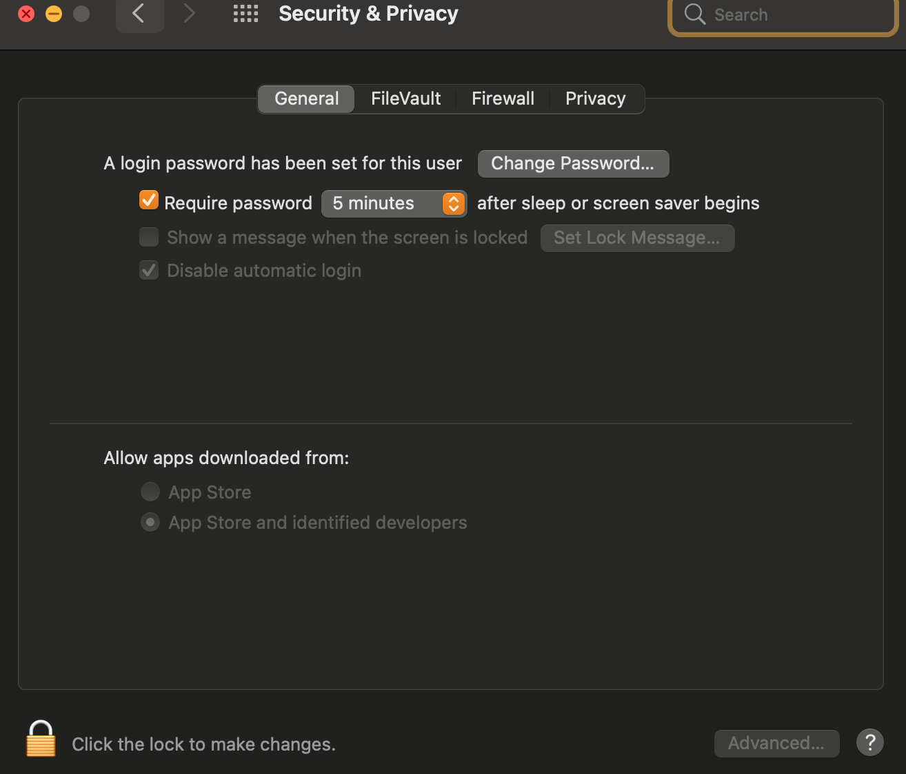

<h1 align="center">
   
	

 
A step by step tutorial on setting up TFVC for OSX
 
</h1>

<h2 align="center">
  <a href="#instructions">Instructions</a> •
  <a href="#requirements">Requirements</a>

</h2>

## Objectives

- To install TEE-CLC (Team Explorer Everywhere Command Line Client) for implimenting Team Foundation Version Control.
- To allow you to use the TEE-CLC to retrieve, edit, and publish changes to TFVC based repositories.

## Process

- This tutorial will first have you install Home Brew, a package manager for OSX, allowing commandline instillation of software from outside sources.  
- Next, it will walk you through using Home Brew to install TEE-CLC.  
- Finally, this tutorial will walk you through setting up your development environment to utilize Team Foundation Version Control, from workspace initilization to your first checkin.

*Disclaimer!! It is important to note that some, or all of this software might trigger a security warning on your device. This software is from trusted sources, and widely supported, however, as with any command line usage, please proceed with caution.*

*If after an attempted instillation it appears nothing has happened, or you recieving an error/warning that software has attempted to be installed from an outside source, please navigate to the System Preferences app -> Security and Privacy -> General. Click the lock icon in the bottom left, enter your login password, and click "Allow Anyway" before repeating the procces"*

## Requirements/Resources:
**Please wait to install any outside resources until instructed.**
- Computer running Mac OSX 10.14 (Mojave) or higher
- Home Brew <a href="https://brew.sh/"> Here</a>
- TEE-CLC version 14.135.0 <a href="https://github.com/Microsoft/team-explorer-everywhere/releases"> Here</a>
- OSX Terminal.
- Microsoft tf command line documentation <a href="https://docs.microsoft.com/en-us/azure/devops/repos/tfvc/use-team-foundation-version-control-commands?view=azure-devops"> Here</a>

## Instructions:
**Please follow these intructions in exactly the order they are given**  
*Home Brew instillation*
1. Open a new terminal window
2. Paste the following into console:  
`/bin/bash -c "$(curl -fsSL https://raw.githubusercontent.com/Homebrew/install/HEAD/install.sh)"`
3. Enter your login password and hit return.

*TEE-CLC instillation*

1.

## Further reading/Documentation

## Support

Or

## You may also like...

-- Other projects in my GitHub Repository

## License

MIT

---
## Frederick Ernest
> LinkedIn [FrederickErnest](https://www.linkedin.com/in/frederick-ernest/) &nbsp;&middot;&nbsp;
> GitHub [FrederickErnest](https://github.com/fetonecontrol/) 